# Tarea 02 · Despliegue de Aplicaciones Web
___
## Oliver Fabian Stetcu Stepanov
___
### Tarea Git - Github - Markdown - Visual Studio Code
___
>Crea un repositorio PRIVADO en Github con la documentación de esta práctica. Añade la profesor
como colaborador de ese repositorio. Redacta la práctica usando Markdown, aporta trozos de código
con los comandos git y capturas de pantalla.

>Redacta la práctica usando Markdown, aporta trozos de código con los comandos ``git`` y capturas de pantalla.

>Ten en cuenta que para realizar la práctica tendrás que hacer un segundo repositorio: primero local y después remoto asociado a Github. En este repositorio también debes poner al profesor como colaborador y hacer referencia a él en el archivo README.md previo a la documentación.
# 1.- GIT.
___
## 1.1.- Instalación y configuración inicial. (config)
>Para trabajar en Windows con git utilizaremos la terminal: git bash.

Instala o comprueba que ya este instalado el servicio: git.
>Utiliza --version para mostrar la versión.

>Utiliza el comando which git para saber la ubicación del ejecutable.

Muestra el archivo de configuración global de git.
>El archivo de configuración global de git, si está creado, se encuentra en: ~/.gitconfig

Configura de forma global los datos de usuario: nombre y correo electrónico.

Muestra el listado de las distintas opciones de configuración.

Vuelve a mostrar el archivo de configuración global.

Primero, vamos a comprobar que tenemos instalado nuestro servicio ``git`` y queremos saber la ubicación del ejecutable. Para ello, 
vamos a darle click derecho en nuestra carpeta de **Despliegue/DocumentacionTarea02** y ponemos los siguientes comandos:

```bash
git --version
which git
```
Resultado:

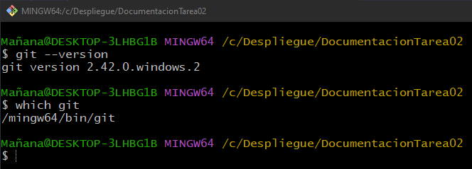

Ahora muestro el archivo de configuración global de ``git`` (se encuentra en ``~/.gitconfig.``):

```bash
cat ~/.gitconfig
```
Resultado:

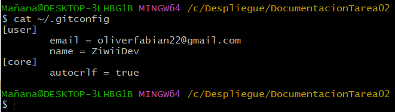

Configuramos de forma global los datos del usuario (usuario y correo electrónico) y mostramos el listado de las distintas opciones de configuración, ejecutamos los siguientes comandos:

```bash
git config --global user.email oliverfabian22@gmail.com
git config --global user.name ZiwiiDev
git config --list
```
Resultado:

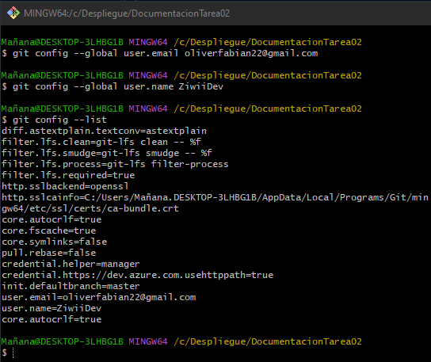

Volvemos a mostrar el archivo de configuración global (en mi caso saldrá lo mismo porque ya lo tenía configurado de antes):

```bash
cat ~/.gitconfig
```
Resultado:

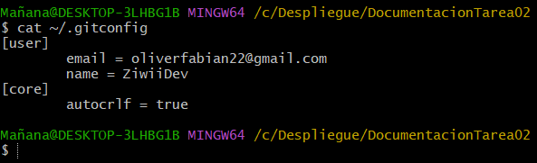

## 1.2.- Crear repositorios locales (init, status, add, commit, log)
Vamos a crear un repositorio llamado **despliegue-demo**. Crea una carpeta con el mismo nombre que el repositorio y accede a ella.

Inicia un repositorio.

>Recuerda usar ``git status`` y ``git log --oneline`` para ir comprobando el estado de git y los registros de commit.

Muestra el estado de git antes de nada.

Muestra también los registros de commit antes de realizar cambios. Como aún no has hecho ningún commit, debe darte un error.

Crea desde la línea de comandos un archivo **README.md** que contenga el nombre del repositorio.

>Puedes crear un archivo desde terminal con el comando ``echo 'Contenido del archivo' > archivo.md.`` Si lo que quieres es un archivo vacío puedes usar el comando ``touch archivo.md`` y después con ``nano`` darle contenido.

Vuelve a mostrar el estado de git después de crear un archivo.

Añade el archivo recién creado al área de intercambio o ``staged``.

Vuelve a mostrar el estado de git después de añadir un archivo al ``staged``.

Añade los archivos del área de intercambio al repositorio local con ``commit``.

>Recuerda poner un mensaje al realizar el commit, con ``-m "mensaje"``.

Vuelve a mostrar el estado de git después de añadir un archivo al ``commit``.

Muestra los registros de commit después de realizar este primer commit.

>Existe un comando git para a modificar el último commit. Este comando elimina el último commit y crea otro nuevo con los cambios actuales del ``staged``. El comando es ``git commit --amend -m "mensaje"``.

Primero vamos a crear un repositorio **despliegue-demo**, vamos a crear la carpeta con este nombre y accedemos a ella:

```bash
cd ..
mkdir despliegue-demo
cd despliegue-demo
```
Resultado:

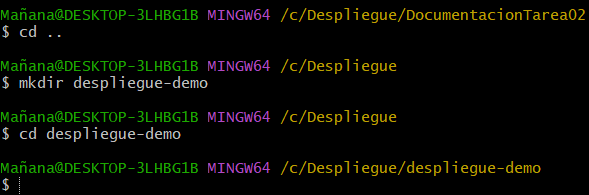

Inicializamos el repositorio, comprobamos el estado de git y comprobamos el registro de commits (como no hemos hecho ningún commit nos da un error):

```bash
git init
git status
git log --oneline
```
Resultado:


Creamos un archivo **README.md** y mostramos el estado de git después de crear el archivo:

```bash
touch README.md
nano README.md
git status
```
Resultado:

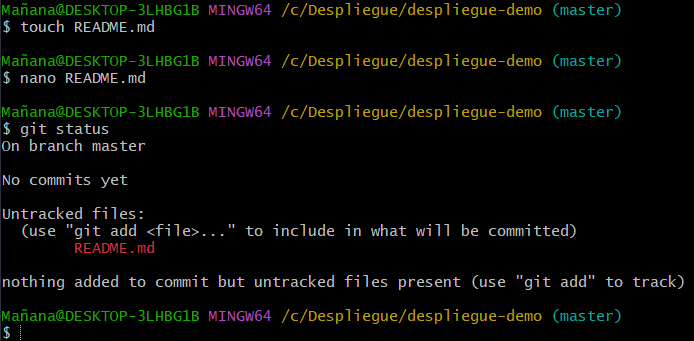

Añado el archivo recién creado al **staged**, muestro el estado de git después de añadirlo de la siguiente manera:

```bash
git add README.md
git status
```
Resultado:

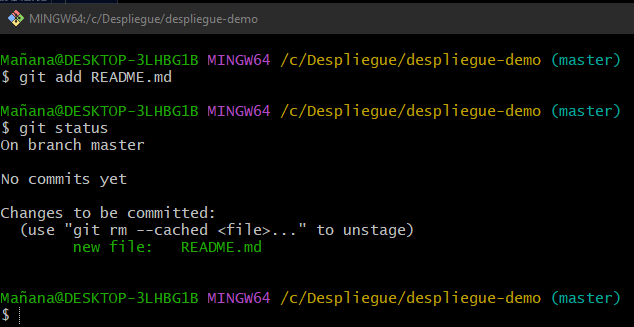

Añado el archivo al repositorio local, le ponemos mensaje, y muestro el estado:

```bash
git commit -m "Añado README.md"
git status
```
Resultado:

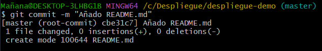

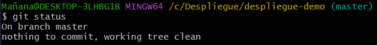

Muestro los registros de commit después de realizar el primer commit:

```bash
git log --oneline
```
Resultado:

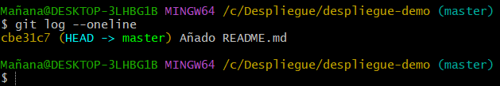

## 1.3.- Deshacer cambios en repositorios locales
### 1.3.1.- Cambios en un archivo que ya se ha incluido en algún commit. (diff, restore)
>Recuerda usar git diff, git diff HEAD o git diff --cached / git diff --staged para ir
viendo las diferencias de los archivos.

>Puedes usar HEAD, HEAD~1, HEAD~2, ... para referenciar el último commit, al anterior, ...

Vamos a modificar el archivo **README.md**. Lo editamos con un editor gráfico o desde el terminal con nano. Insertamos un par de espacios en blanco y ponermos el nombre del módulo: Despliegue de aplicaciones web.

Muestra el contenido del archivo **README.md**.

Muestra el estado de git después de las modificaciones.

Muestra las diferencia de los cambios entre el directorio de trabajo y el último commit.

Añadimos el archivo al ``staged``.

Vuelve a mostrar el estado de git después de añadir un archivo al ``staged``.

Vuelve a mostrar las diferencia de los cambios pero esta vez entre el ``staged`` y el último commit.

Ahora deshaz este cambio y que el cambio se quede en el directorio de trabajo o ``workspace``.

>Recuerda utilizar ``git restore`` con los parámetros adecuados en lugar de ``git reset`` o ``git checkout``. Es la recomentación de las versiones más actuales de git.

Vuelve a mostrar el estado de git después de deshacer los cambios.

Muestra el contenido del archivo **README.md**. La línea con el nombre del módulo debe seguir estando ya que hemos deshecho el ``staged`` pero aún no hemos restaurado la copia del commit anterior.

Ahora sí queremos restaurar la copia del commit anterior. Es decir, deshacer los cambios del directorio de trabajo.

Vuelve a mostrar el contenido del archivo **README.md**. Ya debe verse como se salvo en el anterior commit.

Muestra el estado de git para comprobar el estado de los cambios en el directorio de trabajo.

Para ello, modificamos el archivo **README.md** añadiéndole un par de espacios en blanco y le ponemos el nombre del módulo. Ejecutamos el siguiente comando y mostramos el contenido del archivo:

```bash
nano README.md
```
Resultado:

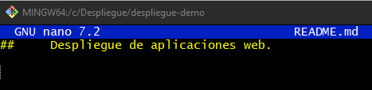

Hacemos un ``git status`` para ver el estado de git después de las modificaciones:

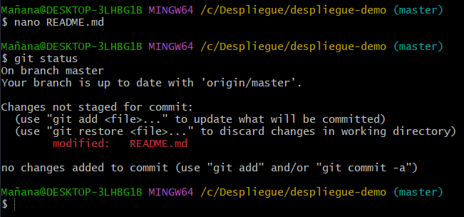

Muestro las diferencias entre el directorio de trabajo y el último commit (con "+" las líneas que se han agregado y con "-" las que se han eliminado):

```bash
git diff HEAD
```
Resultado:

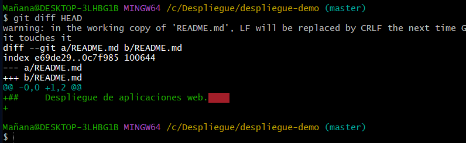

Podemos ver que se ha agregado ese texto, donde aparece el "+".

Añadimos el archivo al **staged** mediante el siguiente comando:

```bash
git add README.md
```
Resultado:

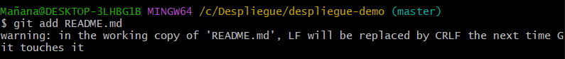

Me sale un warning debido a los espacios en blancos.

Hacemos un ``git status`` para ver el estado de git después de las modificaciones:

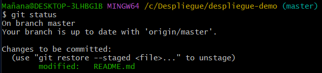

Nos aparecen los cambios que vamos a realizar al hacer un commit.

Muestro las diferencias de los cambios entre el ``staged`` y el último commit (se puede usar cualquiera de los 2 comandos, hacen lo mismo):

```bash
git diff --staged   o   git diff --staged HEAD
```
Resultado:

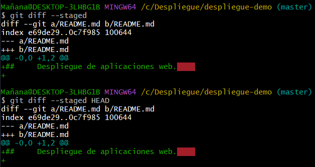

Aparece lo mismo porque no hemos hecho el commit todavía.

Vamos a deshacer el cambio y lo dejamos en el directorio de trabajo con el siguiente comando. Lo muestro.

```bash
git restore --staged README.md
git status
```
Resultado:

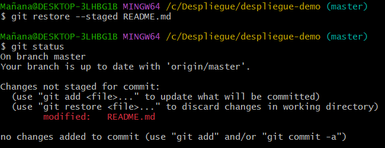

Ahora es como si no hubiesemos hecho el ``git add README.md``.

Muestro el contenido del **README.md** Sigue todo igual porque hemos deshecho el ``staged`` pero aún no hemos restaurado la copia del commit anterior con ``cat README.md``:

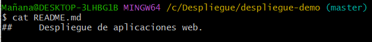

Restauramos la copia del commit, es decir, deshacemos los cambios del directorio de trabajo con el siguiente comando (reestablece a la versión antes del commit), y muestro el estado de Git con los cambios realizados:

```bash
git reset --hard
git status
```
Resultado:

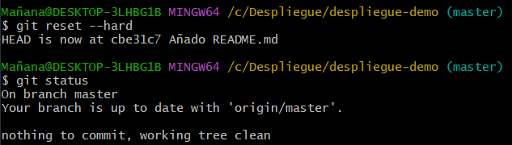

Ahora muestro el contenido del **README.md** (aparece vacío porque es como estaba en el anterior commit):

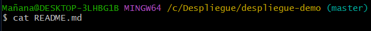

### 1.3.3.- Cambios en un commit (revert, reset, show, tag)
Crea un nuevo archivo **centro.md** con el nombre del instituto y haz un ``commit``.

>Puedes hacer la acciones add + commit en un solo paso con: ``git commit -am 'mensaje'``. Pero esto solo funciona con los archivos que ya están en un commit, no con los archivos nuevos.

Muestra los registros de commit.

Muestra las diferencias entre los dos últimos commit

>CUIDADO con ``git revert`` y ``git reset`` ya que son comando destructivos. Solo usar en local no usar en los repositorios remotos.

Revierte el último commit.

>Como el comando ``revert`` crea un nuevo commit debes indicar un mensaje o utilizar el mensaje que te proponen.

Vuelve a mostrar los registros de commit. Debe aparecer un nuevo commit revertiendo los cambios.

Muestra el listado de archivos del directorio para comprobar si se ha eliminado el archivo **instituto.md**.

>Si quisieramos hacer varios revert seguido podemos usar el modificador ``--no-commit`` y al terminar de revertir cambios usariamos git ``revert --continue``.

Añade tu nombre al archivo README.md y haz un commit.

Muestra el nuevo contenido de **README.md**.

Muestra el estado de git para ver que el directorio de trabajo está limpio.

Muestra los registro de commit.

Elimina el último commit que modificaba el archivo **README.md**, pero manteniendo los cambios en el directorio de trabajo.

Vuelve a mostrar los registros de commit para ver que el último commit ha desaparecido.

Vuelve a mostrar el estado de git para ver que los cambios están en el directorio de trabajo.

Si queremos obtener una información más extensa de los cambios que se han producido en un commit podemos usar el comando show. Por ejemplo, para ver los cambios del último commit podemos hacer: ``git show HEAD`` o ``git show 8553abd``.

Siguiente ejemplo de reset. Añade y haz commit con los cambios que están pendientes.

Muestra los registro de commit.

Elimina por segunda vez el último commit que modificaba el archivo **README.md**, pero manteniendo los cambios del ``staged``.

Vuelve a mostrar los registros de commit para ver que el último commit ha desaparecido.

Vuelve a mostrar el estado de git para ver que los cambios ahora están en el ``staged``.

Último ejemplo de reset. Haz commit con los cambios que están pendientes.

Muestra los registro de commit.

Elimina por última vez el último commit que modificaba el archivo **README.md** sin guardar los cambios.

Vuelve a mostrar los registros de commit para ver que el último commit ha desaparecido.

Vuelve a mostrar el estado de git para ver que no hay cambios pendientes.

>No se debe utilizar reset para borrar commit que ya se ha subido a repositorios remotos. Solo para uso local y commit recientes que no se han publicado y otras personas pueden estar usando.

Marca el último commit como etiqueta ligera **v2.1**. Marca el anterior commit como etiqueta anotada **v.2.0**.

Vuelve a mostrar los registros de commit para ver las etiquetas recién creadas.

Muestra la información detallada de la etiqueta v2.0. Usa el comando ``show``.

Para ello, primero vamos a crear el archivo **Aguadulce.md** y hacemos un commit:

```bash
touch Aguadulce.md
git status
git add Aguadulce.md
git commit -m "Añado Aguadulce.md"
```
Resultado:

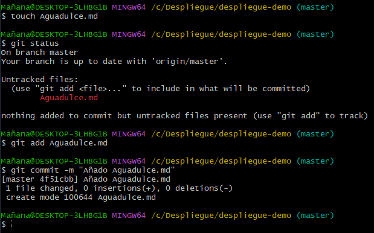

Muestro el estado y el registro de commits con:

```bash
git status
git log --oneline
```

Resultado:

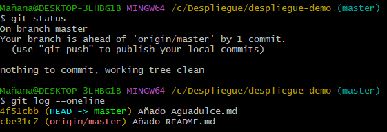

Para mostrar la diferencia entre los dos últimos commit ejecutamos el siguiente comando:

```bash
git diff HEAD HEAD~1
```

Resultado:

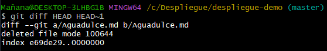

Revierto el último commit utilizando el mensaje que tiene el último commit y muestro el registro de commit:

```bash
git revert --no-edit HEAD
git log --oneline
```

Resultado:

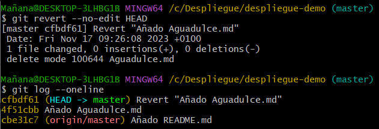

Muestro un listado de los archivos del directorio para comprobar que se ha eliminado **Aguadulce.md**:

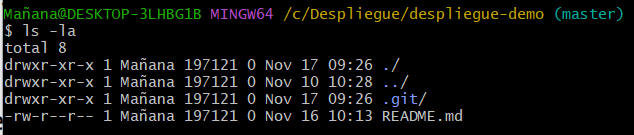

Añado mi nombre al archivo **README.md**, hago un commit, muesto el contenido del archivo y muestro el estado de git para comprobar que está todo limpio:

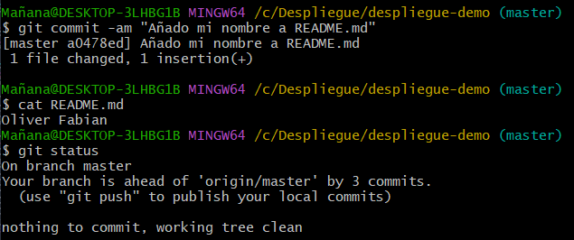

Utilizo ``'git commit -am "mensaje"'`` para hacer el **add** y el **commit** en un sólo paso.

Muestro los registros de commit, elimino el último commit que modificaba el archivo **README.md** pero manteniendo los cambios en el directorio de trabajo:

```bash
git log --oneline
git reset --mixed HEAD^
git log --oneline
git status
```

Resultado:

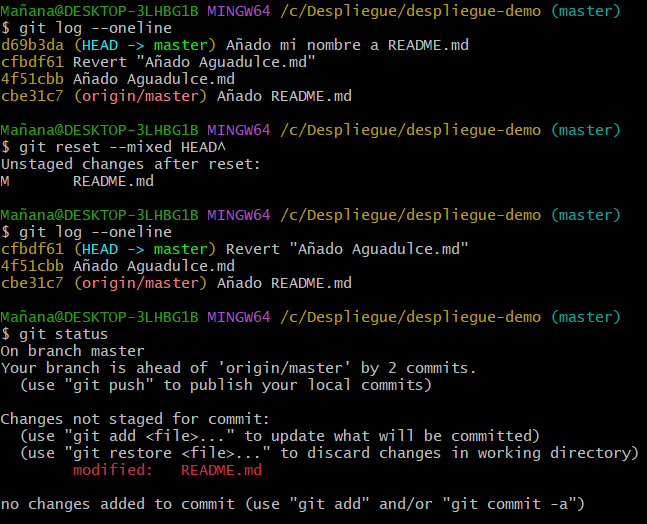

Con ``--soft`` consigo mantener los cambios en el directorio de trabajo. Aparece en el estado de git que debemos hacer commit para añadir el **README.md**, ya que aunque lo hayamos hecho anteriormente, al hacer el ``revert`` se ha eliminado el último commit pero los cambios realizados en el **README.md** siguen estando.

Para obtener una información más extensa de un commit podemos utilizar el comando siguiente:

```bash
git show HEAD
```

Resultado:

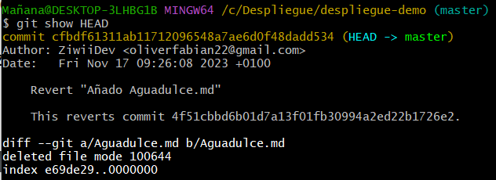

Ahora añado y hago commit de los cambios pendientes y muestro el registro de commit:

```bash
git commit -am "Añado commit para otro ejemplo de reset"
git log --oneline
```

Resultado:

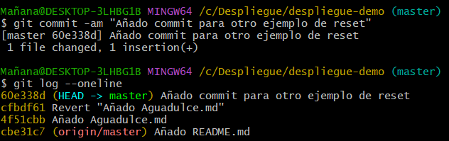

Elimino por segunda vez el último commit (el que acabo de hacer) pero manteniendo los cambios del ``staged``, vuelvo a mostrar los registros de commit y el estado de git:

```bash
git reset --soft HEAD^
git log --oneline
git status
```

Resultado:

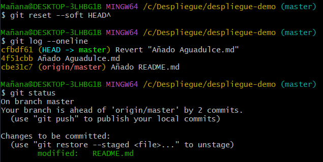

Para el último ejemplo de ``reset`` vamos a hacer un commit con los cambios que están pendientes, muestro los registros de commit, elimino por última vez el último commit sin guardar los cambios, después muestro los registros de commit y el estado de git con los siguientes comandos:

```bash
git commit -m "Último ejemplo de reset sin mantener los cambios"
git log --oneline
git reset --hard HEAD^
git log --oneline
git status
```

Resultado:

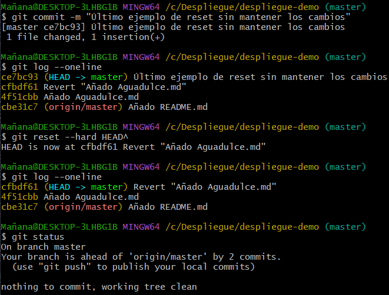

Marco el último commit como etiqueta ligera v2.1, marco el anterior commit como etiqueta anotada v2.0, muestro los registros de commit para ver las etiquetas creadas recientemente y muestro la información detallada de la etiqueta v2.0 con los siguientes comandos:

```bash
git tag v2.1 cfbdf61        o       git tag v2.1
git tag -a v2.0 4f51cbb -m "Versión 2.0 del commit anterior al último"
git log --oneline
git show HEAD~1
```

Resultado:

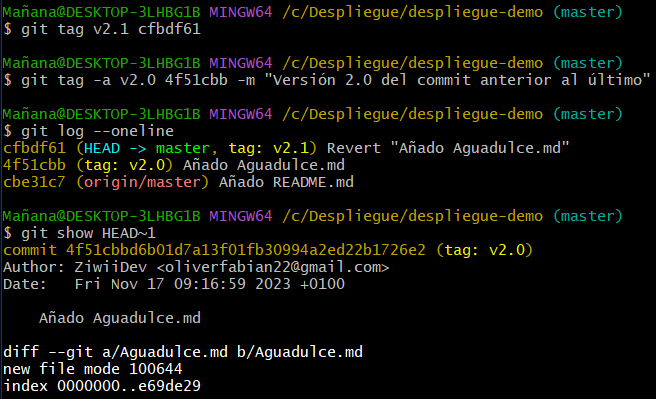

Si no se indica ningún commit (el texto que va después de asignar la versión de la etiqueta, en este caso "cfbdf61" sería el último commit) se asociará esta etiqueta con el commit actual.

Se puede crear la etiqueta anotada sin mensaje también eliminando el ``-m "mensaje"``.

## 1.4.- Ramas (branch, switch, merge)
Muestra el estado de git. No debe haber cambios para hacer commit.

Muestra las ramas.

Crea una nueva rama llamada **rama-nueva**.

Volver a mostrar las ramas.

Cambiar a la nueva rama.

Volver a mostrar las ramas. Debe aparecer que nos hemos movido de rama.

Cambia el nombre de la rama a: **rama-antigua**.

Volver a mostrar las ramas. El nombre debe haber cambiado.

Elimina la rama **rama-antigua**.

Volver a mostrar las ramas. La rama ya no debe estar.

> Recuerda utilizar ``git switch`` con los parámetros adecuados en lugar de ``git checkout``. Es la recomentación de las versiones más actuales de git. Tened en cuenta que ``ckekout`` tambien permite deshacer cambios y es más destructiva.

Muestra el estado de git.

Modifica el archivo **README.md** y añade tu nombre.

Muestra el estado de git. Debe aparecer el cambio que hemos hecho.

Crea una rama llamada **rama-modificacion** y cambiate a ella en un solo paso.

Vuelve a mostrar el estado de git. El cambio que hemos hecho en el directorio de trabajo sigue estando ahí.

Añade los cambios a ``staged`` y vuelve a mostrar el estado de git.

Cambia a la rama principal y vuelve a mostrar el estado de git. Los cambios añadidos al ``staged`` siguen estando en su sitio.

Asegurate de estar en la **rama modificacion** y lleva los cambios a ``commit``.

Muestra el estado de git y muestra el contenido del archivo **README.md**.

Cambia a la rama principal, master o main y muestra el contenido del archivo **README.md**. Debe ser diferente al mostrado anteriormente. Ahora tenemos dos ramas con código diferente.

> El comando ``--discard-changes`` de ``switch`` permite eliminar los cambios, si los hubiera, antes de crear una nueva rama y cambiar a ella.

Vamos a ver como seguir el historial de commit en ambas ramas. Posicionate en la rama **principal** y muestra el registro de commit.

Cambia a la rama **rama-modificacion** y muestra el registro de commit. Debe haber uno más.

> Si lo que queremos es ver en qué commit se a modificado un determinado archivo podemos indicarselo al comando ``log`` con el parámetro ``--follow archivo.txt``. Por ejemplo, si queremos saber los commit en los que ha cambiado **README.md**: ``git log --oneline --follow README.md``.

Para no tener que estar cambiando de rama para ver los registro de commit debemos usar el parámetro ``--all``. Para añadir los punteros a las ramas usamos el parámetro ``--decorate``. Para mostrar los caminos que sigue cada rama usamos el parámetro ``--graph``.

> Se puede hacer un alias para escribir todo esto con: ``git config --global alias.logfull 'log --oneline --decorate --all --graph'``. Para mostras todos los alias podemos escribir: ``git config --global --get-regexep alias``. Para eliminar un alias usamos: ``git config --global --unset alias.logfull``.

Vamos a hacer una modificación en la rama principal creando un nuevo archivo llamado: **fecha.md** con la fecha de hoy. Y vamos a hacer commit de este cambio en la rama principal.

Mostramos el registro de commit con todos los datos. Se debe ver que han surgido dos líneas que separan las ramas que teníamos. Ahora las ramas tienen contenidos diferentes.

Vamos a fusionar las ramas con las que estamos trabajando. Desde la rama **principal** fusiona la rama **rama-modificacion**.

Vuelve a mostrar el registro de commit con todos los datos. Ahora las líneas de ramas se deben haber unido.

Como ya hemos fusionado las ramas ya podemos borrar el rama **rama-modificacion**. Y listar la ramos que tenemos.

> Al fusionar ramas se nos pueden crear distintas situaciones: que se fusionan sin crear nuevos commit, que se fusionen creando nuevos commit o que no se puedan fusionar automaticamente por que haya algun conflicto que resolver manualmente. Los conflictos se dan cuando modificamos la misma línea de un archivo en distintas ramas. Si se nos presenta un conflicto y no queremos resolverlo podemos volver deshacer la fusión con ``git merge --abort``.

> El comando ``--orphan`` de ``switch`` permite crear ramas huerfanas y cambiar a ellas. Estas ramas pueden ser útiles para adjuntar información anexa a un proyecto, por ejemplo: documentación, web informativa...

Primero, vamos a mostrar el estado de git (debe aparecer sin cambios a realizar), muestro las ramas, creo una nueva rama llamda **rama-nueva** y muestro las ramas con los siguientes comandos:

```bash
git status
git branch
git branch "rama-nueva"
git branch
```

Resultado:

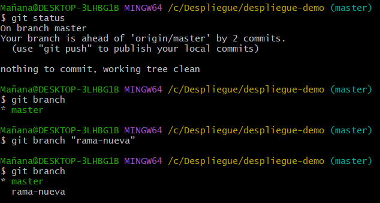

Al hacer el ``git branch "rama-nueva`` para crear una nueva rama, se pueden omitir las comillas.

Ahora nos cambiamos a la rama que he creado anteriormente (rama-nueva), muestro las ramas que tenemos (aparece la rama a la que nos hemos movido), cambio el nombre de la rama a "rama-antigua" y vuelvo a mostrar las ramas (el nombre debe haber cambiado) con los siguientes comandos:

```bash
git switch rama-nueva
git branch
git branch -M rama-antigua
git branch
```

Podemos utilizar ``git checkout -b rama-nueva`` para crear una rama nueva llamada "rama-nueva" y cambiarnos a ella en un sólo comando.

Con ``-M`` podemos cambiar el nombre de la rama (con ``-m`` también funciona).

Podemos utilizar ``git checkout rama-nueva`` en vez de ``git switch rama-nueva``, pero no es recomendable ya que el **checkout** también permite deshacer cambios y es más destructiva.

Resultado:

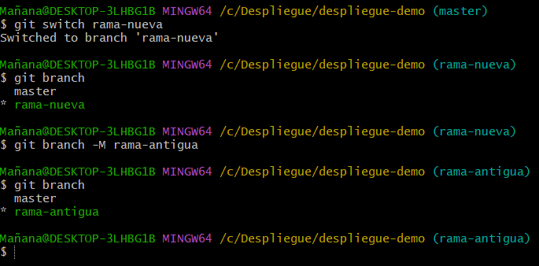

Vamos a eliminar la rama **rama-antigua**, luego muestro las ramas (ya no debe aparecer la rama "**rama-antigua**") y muestro el estado de git.

```bash
git switch master
git branch -d rama-antigua
git branch
git status
```

Con "``git branch -d rama-antigua``" borro la rama, para poder borrarla he tenido que salirme de la rama anteriormente y meterme en la **master**, porque sino no podría borrarla.

Resultado:

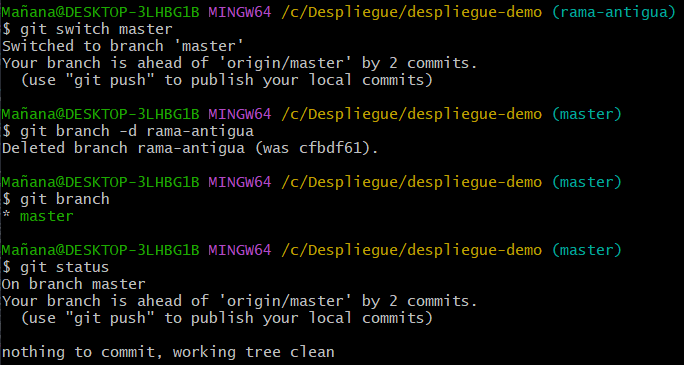

Modifico el estado del **README.md** añadiendo mi nombre, muestro el estado de git (debe aparecer el cambio realizado), creo una rama llamada **rama-modificacion**, compruebo que me he cambio a ella en un sólo paso (la ha creado y me ha cambiado a ella correctamente) de la siguiente manera:

```bash
git status
git checkout -b rama-modificacion
git branch
```

Resultado:

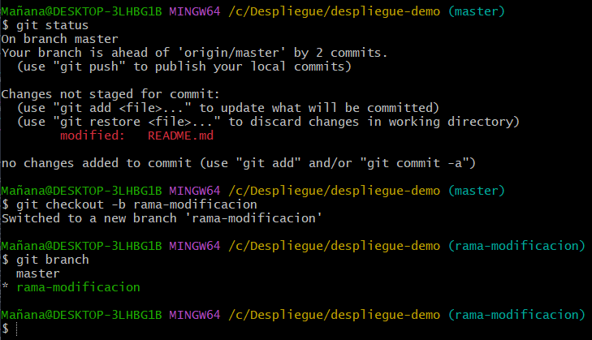

Con ``git checkout -b "rama"`` podemos crear la rama y cambiarnos a ella en un sólo paso.

> El comando ``--discard-changes`` de ``switch`` permite eliminar los cambios, si los hubiera, antes de crear una nueva rama y cambiar a ella.

Vuelvo a mostrar el estado de git (el cambio que hemos hecho en el directorio de trabajo sigue estando ahí), añado los cambios al ``staged`` y vuelvo a mostrar el estado de git con los siguientes comandos:

```bash
git status
git add README.md
git status
```

Resultado:

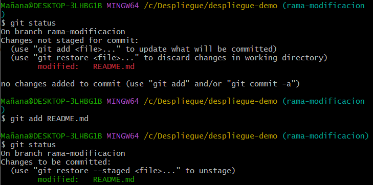

Cambio a la rama principal y vuelvo a mostrar el estado de git (los cambios añadidos al ``staged`` siguen estando en su sitio):

```bash
git switch master
git status
```

> Si tenemos el repositorio subido a GitHub nos da error al intentar cambiar de rama debido a que se va a sobreescribir el archivo **README.md**.

Resultado:

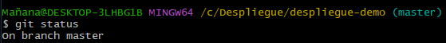

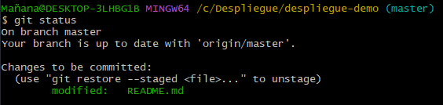

Nos cambiamos a la **rama-modificacion** y hacemos un commit:

```bash
git switch rama-modificacion
git commit -m "Actualizo README.md"
git status
```

Resultado:

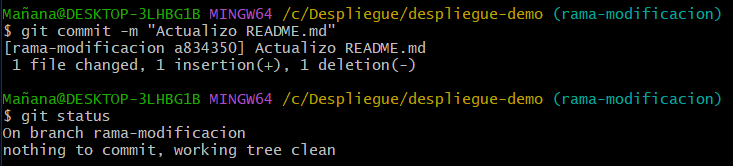

Muestro el contenido del archivo **README.md**, me cambio a la rama principal y vuelvo a mostrar el contenido del archivo **README.md**. (Debe ser diferente al mostrado anteriormente. Ahora tenemos dos ramas con código diferente):

Resultado:

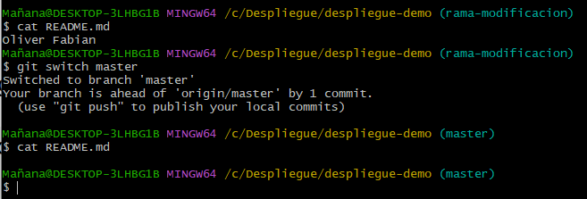

Vamos a ver como seguir el historial de commit en ambas ramas. Para ello, vamos a la rama principal y muestro el registro de commit, y luego nos cambiamos a la rama **rama-modificacion** y muestro el registro de commit también:

```bash
git log --oneline
git switch rama-modificacion
git log --oneline
```

Resultado:

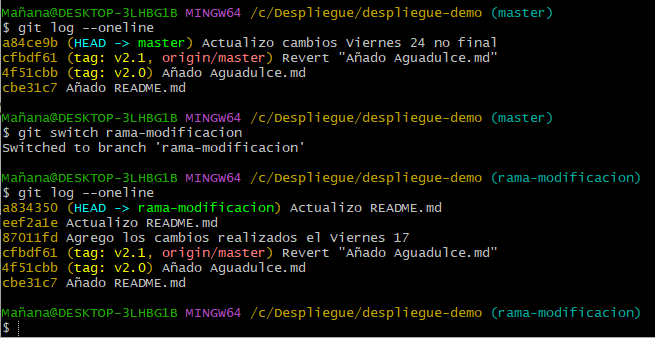

Para no tener que estar cambiando de rama para ver los registro de commit debemos usar el parámetro --all. Para añadir los punteros a las ramas usamos el parámetro --decorate. Para mostrar los caminos que sigue cada rama usamos el parámetro --graph.

```bash
git log --all --decorate --graph --oneline
```

Resultado:

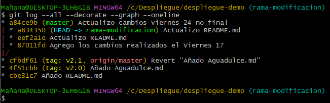

> Se puede hacer un alias para escribir todo esto con: git config --global alias.logfull 'log --oneline --decorate --all --graph'.

Vamos a hacer una modificación en la rama principal creando un nuevo archivo llamado: fecha.md con la fecha de hoy. Y vamos a hacer commit de este cambio en la rama principal.

```bash
echo "Viernes, 24 de Noviembre de 2023" > fecha.md
git add fecha.md
git commit -m "Añado fecha.md"
```

Resultado:

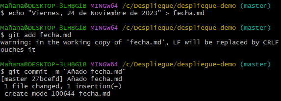

Muestro el registro de commit con todos los datos. Se debe ver que han surgido dos líneas que separan las ramas que teníamos. Ahora las ramas tienen contenidos diferentes.

```bash
git log --all --decorate --graph --oneline
```

Resultado:

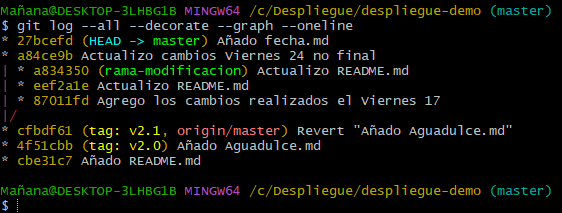

Vamos a fusionar las ramas con las que estamos trabajando. Desde la rama **principal** fusiono la rama **rama-modificacion**, muestro el registro de commit con todos los datos (ahora las líneas de ramas se deben haber unido):

```bash
git merge rama-modificacion
git status
git add .
git commit -m "Merge de ambas ramas"
git log --all --decorate --graph --oneline
git branch -d rama-modificacion
```

Al hacer el merge me aparece un conficto debido a que hay contenido distinto en el archivo **README.md** de cada rama, por lo que aparece que se va a sobreescribir, lo añado al ``staged`` y lo comiteo. Luego muestro el registro de commit con todos los datos y borro la rama ``rama-modificacion``:

Resultado:

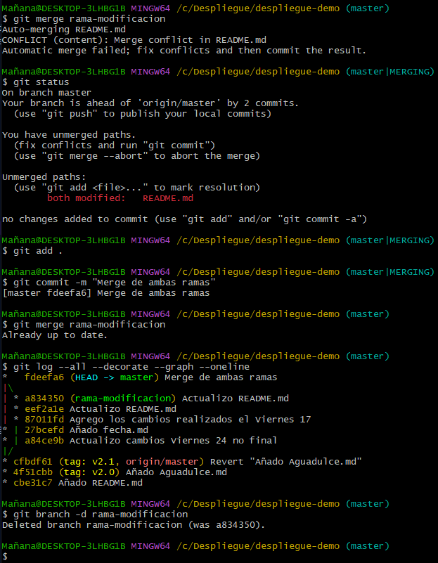

Listo las ramas que tengo:

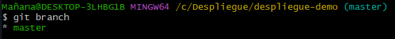

# 2.- Github. Trabajo en equipo.
### 2.1.- Configurar respositorios remotos (remote)
Muestra los repositorios remotos que tienes configurados. Usa el parámetro ``-v`` para tener una información ampliada.

Muestra las ramas que tenemos. Usa el parámetro ``--all`` para mostrarlas todas.

Ve a la web de Github. Accede con tu usuario y contraseña y crea un repositorio. Una vez creado copia tu URL del método ``https``. Añade capturas de pantalla de este proceso.

De vuelta a la terminal **git bash**, crea el remoto con el enlace copiado anteriormente. Puedes dejar la abreviación en ``origin`` o ponerle el nombre que quieras.

Vuelve a mostrar los repositorios remotos que tienes configurados.

Muestro los repositorios remotos que tengo configurados. Uso el parámetro ``-v`` para tener una información ampliada. Además, muestro las ramas que tengo (uso el parámetro ``all`` para mostrar todas)

```bash
git remote -v
git branch --all
```

Resultado:

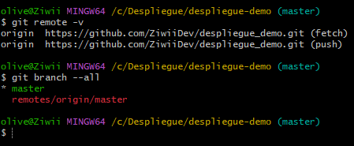

He hecho este apartado en mi casa, por eso aparece "**olive@Ziwii**" en vez del otro usuario de Mañana utilizado en clase.

Al hacer ``git remote -v`` me aparece el remoto con nombre ``origin`` ya hecho porque lo hice anteriormente.

Ahora, voy a la web de Github. Accedo con mi usuario y contraseña y creo un repositorio (ya he subido el repositorio a GitHub anteriormente, por eso no lo volveré a hacer, pero voy a mostrar los pasos de cómo se hace mediante ``HTTPS``):

Vamos a "Mis Repositorios".

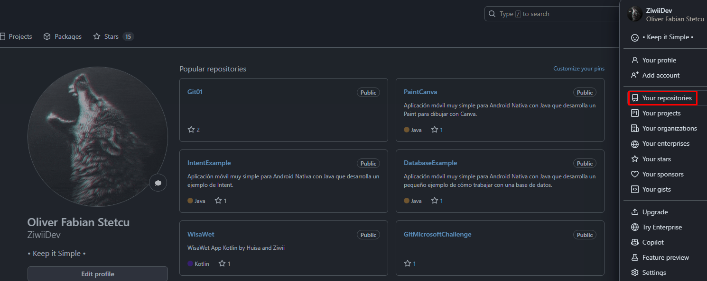

Luego le damos al botón verde llamado "New".

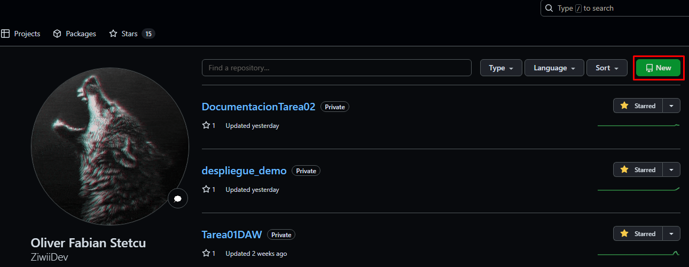

Le ponemos el nombre que queremos que tenga el repositorio remoto (en este caso sería "**despliegue_demo**", pero cómo ya lo tengo creado me aparece que ya está creado, pero debería aceptarlo si no está creado todavía). Lo pongo privado.


Si creamos el repositorio nos aparecerá lo siguiente (lo mustro con un repositorio llamado "despliegue-demo" para mostrar cómo se haría). Podemos hacerlo mediante **SSH** o **HTTPS**. Copiamos la ``URL`` de **HTTPS** para hacerlo de esta manera, sería: "https://github.com/ZiwiiDev/despliegue-demo.git".


Volvemos al terminal de ``git bash`` y creamos el remoto con el enlace copiado anteriormente (dejo la abreviación en origin):

```bash
git remote add origin https://github.com/ZiwiiDev/despliegue-demo.git
git remote -v
```

Vuelvo a mostrarlos repositorios que tengo configurados.

Con el repositorio que he creado ya sería: "git remote add origin https://github.com/ZiwiiDev/despliegue_demo.git


A mí me aparece que ya existe, pero si no lo hubiera hecho aparecería algo así:


Donde aparece la url sería la que copiamos anteriormente por ``HTTPS`` (he cogido esta imagen de prueba de internet para moestrar qué aparecería en caso de hacer el remoto y subir el repositorio a GitHub, yo lo hice antes para tenerlo guardado en remoto por si se me perdía algo).

Podemos hacerlo también mediante ``SSH``, en nuestro equipo el par de claves asimétricas ssh, luego generamos una clave ``SSH`` en GitHub, copiamos la clave y la pegamos para generar la clave ``SSH``. Hacemos el "``git remote``" con origin y lo que nos aparece al crear el repositorio en GitHub (git@github.com:ZiwiiDev/despliegue_demo.git), luego hacemos "``ssh -T git@github.com``".

Si aparece el siguiente error:
> fatal: unable to access 'https://ZiwiiDev:71dZmpirsmNsRVQnEj7gfRsdbj8NOfsdDqBOflDa/u4@github.com/ZiwiiDev/Git01.git/': URL rejected: Port number was not a decimal number between 0 and 65535

Tenemos que ejecutar el siguiente comando:

```bash
git remote set-url origin https://github.com/ZiwiiDev/despliegue_demo
```
Y ya tendríamos subido nuestro repositorio a GitHub de forma remota, ahora lo tendríamos tanto en local como en remoto.

# 2.2.- Subir repositorio (push, .gitignore)
Vuelve a mostrar las ramas que tenemos en nuestro directorio.

Sube la rama principal al repositorio remoto que acabas de configurar. Al usar ``https`` te pedirá el usuario y la contraseña de github. Añade el parámetro ``-u`` para añadir la referencia al upstream.

> Si quisieramos subir todas las ramas a nuestro repositorio remoto podemos cambiar el nombre de la rama ``main`` por el parámetro ``--all``.

Vuelve a mostrar las ramas que tenemos. Deberá aparecer una nueva para el repositorio remoto.

Vamos a crear un archivo llamado **secreto.md** que no queremos que se suba a los repositorios remotos. Crea dicho archivo y usa un archivo ``.gitignore`` para evitar que esto suceda.

Modifica el archivo README.md y añade el nombre del módulo. Haz commit de este cambio y de los anteriores.

Sube estos cambios al repositorio remoto.

Comprueba en la web de github que se ha modificado el archivo README.md, se ha añadido el archivo .gitignore pero no el archivo secreto.md. Añade capturas de pantalla de este proceso.

Vuelvo a mostrar las ramas que tenemos en nuestro directorio y subo la rama principal al repositorio remoto que acabo de configurar. Al usar https pedirá el usuario y la contraseña de github. Añado el parámetro ``-u`` para añadir la referencia al upstream. Y vuelvo a mostrar las ramas que tenemos.

```bash
git branch --all
git push -u origin master
git branch
```

Resultado:


A mí me aparece que todo está al día al hacer el "``git push``", esto es porque ya lo he subido a GitHub de forma remota, si no lo hubiera hecho subiría todos los archivos al repositorio remoto. Deberá aparecer una nueva para el repositorio remoto.

Vamos a crear un archivo llamado **secreto.md** que no queremos que se suba a los repositorios remotos. Creo dicho archivo y usa un archivo "**.gitignore**" para evitar que esto suceda.

```bash
echo "Contenido secreto" > secreto.md
touch .gitignore
```

Resultado:


Añado "**secreto.md**" al "**.gitignore**". Modifico el archivo y añado el nombre del módulo.

Si no añado "**secreto.md**" al "**.gitignore**" aparece en el estado de git que se va a subir "**secreto.md**", pero si lo añado no aparece que se va a subir al hacer el commit (el primer ``git status`` es cuando no está añadido al **.gitignore**, y el segundo es cuando sí está añadido):


Ponemos el nombre del módulo en el archivo **README.md**, hacemos commit y subo estos cambios al repositorio remoto:

```bash
git add .
git commit -m "Añado .gitignore"
git push
```

Resultado:


Comprobamos en la web de GitHub que se ha modificado el archivo secreto.md, se ha añadido el archivo .gitignore pero no el archivo secreto.md.


Y así funcionaría el ``.gitignore``.

# 2.3.- Descargar repositorio (clone, fetch, pull)
Vamos a suponer que cambiamos de ordenador y queremos seguir trabajando en el repositorio que ya tenemos subido a github. Crea otra carpeta hermana de despliegue-demo que se llame **ordenador2** y descárgate todo el repositorio con ``clone``.

Modifica el archivo el archivo README.md y deja solo el texto _despliegue-demo_. Realiza un commit y sube los cambios al repositorio remoto con ``push``.

Muestra el registro de commit con todos los datos. Debe aparecer el nuevo commit.

> Cuando trabajamos en equipo a veces queremos saber quién fue la última persona que modifico un archivo. Para ello podemos usar el comando ``blame``, por ejemplo con: ``git blame archivo.txt``.

Comprueba qué usuarios han modificado el archivo README.md con ``blame``.

Si volvieramos a seguir trabajando en el primer ordenador no veriamos estos cambios automaticamente.Cambia a la carpeta **despliegue-demo** original y muestra el registro de commit con todos los datos. No debe aparecer el nuevo commit.

Desde la carpeta original **despliegue-demo**, descarga las actualizaciones de cambios y que se apliquen en el directorio de trabajo con ``pull``.

Vuelve a mostrar el registro de commit con todos los datos. Ya sí debe aparecer el nuevo commit.

Existe otra opción para descargarnos las actualizaciones del repositorio remoto pero que estas no se cargen directamente en nuestro repositorio principal local sino que se queden en el repositorio remotes/origin/main. Desde la carpeta original **despliegue-demo**, vuelve a modifica el archivo el archivo README.md y añade el texto 'hola'. Realiza un commit y sube los cambios al repositorio remoto con ``push``.

Vamos a simular que volvemos a cambiar al **ordenador2**. Cambia de directorio y accede al repositorio.

Muestra todas las ramas incluyendo las remotas. Nos aparecera una tercera rama ``remotes/origin/HEAD`` que nos indica cuál es la rama principal del repositorio remoto.

Muestra el estado de git. Aunque hemos realizado un cambio y subido a Github este no aparece en el estado de git de forma automática.

Descarga las actualizaciones de cambios pero que no se apliquen en el directorio de trabajo con ``fetch``.

Muestra el contenido del archivo **README.md**. Aún no debe aparecer el último texto que añadimos en en otro ordenador. Ya que lo descargamos a la rama ``origin/main`` y no a la ``main`` que es donde estamos trabajando.

Vuelve a mostrar el estado de git. Ahora sí que nos avisa de que nuestra rama principal ``main`` está desactualizada respecto a de la rama ``origin/main`` que nos acabamos de descargar.

En lugar de hacer la sugerencia que nos indica ``git status: git pull`` para actualizar a la última versión de nuestro repositorio remoto, vamos a crear una divergencia de las ramas. Desde la carpeta **ordenador2/despliegue-demo**, crea un nuevo archivo llamado **saludo.md**. Haz un commit local pero no lo subas al repositorio remoto.

Muestra el registro de commit con toda la información. Se deben ver líneas de ramas separadas.

Intenta actualizar el repositorio local con el comando ``pull``. Debe darte un aviso de divergencia de ramas y no hacer el ``pull``.

Esta advertencia es debido a que si ejecutamos el ``pull``, actualizaremos los archivos con los que tenemos en nuestro remoto y el trabajo local se podría perder. En este caso, en lugar de hacer un ``pull`` vamos a realizar una fusión ``merge`` en la rama ``main`` con la rama ``origin/main``. Como para realizar la fusión necesita crear un nuevo commit te pedirá que pongas un mensaje de commit o dejes el que te proponen.

Vuelve a mostrar el registro de commit con todos los datos. Ya sí debe aparecer las líneas de las ramas que vuelven a unirse.

Ahora, vamos a suponer que cambiamos de ordenador y queremos seguir trabajando en el repositorio que ya tenemos subido a github. Para ello, creo otra carpeta hermana de despliegue-demo que se llame ordenador2 y me
descargo todo el repositorio con clone.

```bash
cd ..
mkdir ordenador2
cd ordenador2
git clone https://github.com/ZiwiiDev/despliegue_demo
```

Resultado:


Modifico el archivo el archivo README.md y dejo solo el texto "despliegue-demo".

```bash
ls -la
git status
git add .
```

Resultado:


Realizo un commit y subo los cambios al repositorio remoto con push.

```bash
git commit -m "Modifico README.md"
git push
```

Resultado:


Muestro el registro de commit con todos los datos. Debe aparecer el nuevo commit.

```bash
git log --oneline --all --decorate --graph
```

Si hemos configurado el ``git log`` para que muestre el registro de commit con todos los datos podemos ejecutar el comando ``git logfull``.


Compruebo qué usuarios han modificado el archivo README.md con blame.

```bash
git blame README.md
```


Si volvieramos a seguir trabajando en el primer ordenador no veriamos estos cambios automaticamente. Cambio a la carpeta "**despliegue-demo**" original y muestro el registro de commit con todos los datos. No debe aparecer el nuevo commit.

```bash
cd ..
cd ..
cd despliegue-demo
git log --oneline --all --decorate --graph
```


Ahora, desde la carpeta original "**despliegue-demo**", descargo las actualizaciones de cambios y que se apliquen en el directorio de trabajo con pull. Y vuelvo a mostrar el registro de commit con todos los datos. Ya sí debe aparecer el nuevo commit.

```bash
git pull
git log --oneline --all --decorate --graph
```


Existe otra opción para descargarnos las actualizaciones del repositorio remoto pero que estas no se cargen directamente en nuestro repositorio principal local sino que se queden en el repositorio **remotes/origin/main**. Desde la carpeta original **despliegue-demo**, vuelvo a modificar el archivo el archivo **README.md** y añado el texto 'hola'. Realiza un commit y sube los cambios al repositorio remoto con push.

```bash
git status
git add .
git commit -m "Modifico README.md con "hola""
git push -u origin
```


Vamos a simular que volvemos a cambiar al ordenador2. Cambio de directorio y accede al repositorio. Muestro todas las ramas incluyendo las remotas. Nos aparecera una tercera rama "**remotes/origin/HEAD**" que nos indica cuál es la rama principal del repositorio remoto.

```bash
cd ..
cd ordenador2
cd despliegue_demo
git branch --all
```


Muestro el estado de git. Aunque hemos realizado un cambio y subido a Github este no aparece en el estado de git de forma automática. Descargo las actualizaciones de cambios pero que no se apliquen en el directorio de trabajo con fetch.

```bash
git status
git fetch
```


Muestro el contenido del archivo "**README.md**". Aún no debe aparecer el último texto que añadimos en el otro ordenador. Ya que lo descargamos a la rama origin/main y no a la ``main`` que es donde estamos trabajando. Vuelvo a mostrar el estado de git. Ahora sí que nos avisa de que nuestra rama principal main está desactualizada respecto a de la rama ``origin/main`` que nos acabamos de descargar.


En lugar de hacer la sugerencia que nos indica ``git status: git pull`` para actualizar a la última versión de nuestro repositorio remoto, vamos a crear una divergencia de las ramas. Desde la carpeta "**ordenador2/despliegue-demo**", creo un nuevo archivo llamado "**saludo.md*"". Hago un commit local pero no lo subo al repositorio remoto.

```bash
touch saludo.md
git status
git add .
git commit -m "Añado saludo.md"
```


Muestro el registro de commit con toda la información. Se deben ver líneas de ramas separadas.


Intento actualizar el repositorio local con el comando pull. Debe darte un aviso de divergencia de ramas y no hacer el pull.


Esta advertencia es debido a que si ejecutamos el ``pull``, actualizaremos los archivos con los que tenemos en nuestro remoto y el trabajo local se podría perder. En este caso, en lugar de hacer un ``pull`` vamos a realizar una fusión merge en la rama main con la rama ``origin/main``. Como para realizar la fusión necesita crear un nuevo commit te pedirá que pongas un mensaje de commit o dejes el que te proponen. Vuelvo a mostrar el registro de commit con todos los datos. Ya sí debe aparecer las líneas de las ramas que
vuelven a unirse.


Y así se podría descargar repositorio de GitHub.

# 3.- Markdown
Crea una tabla resumen de los comandos de git. La tabla tendrá tres columnas: la primera con el comando, la segunda con una explicación y la tercera con un ejemplo.
## Resumen de comandos git

|Comando|Función|Ejemplo
|-|-|-|
|init|Inicia un repositorio|git init
|config|Configura opciones de Git|git config --global user.name "nombre"
|add|Añade los cambios al staged|git add archivo.txt
|commit|Guarda los cambios en el repositorio|git commit -m "mensaje"
|status|Muestra el estado de los archivos en el repositorio|git status
|log|Muestra el historial de commit|git log
|diff|Muestra las diferencias entre commits, ramas, archivos...|git diff archivo.txt
|show|Muestra información de un commit|git show -commit-
|tag|Administra tags (etiquetas)|git tag -a v1.0 -m "Versión 1.0"
|restore|Restaura archivos en el directorio de trabajo|git restore archivo.txt
|revert|Crea un commit que deshace todo lo que se ha hecho|git revert --no-edit HEAD
|reset|Reestablece a la versión antes del commit|git reset --mixed HEAD^
|branch|Permite crear, listar o eliminar ramas|git branch nueva-rama
|switch|Cambia de rama|git switch nueva-rama
|merge|Fusiona ramas|git merge otra-rama
|remote|Administra repositorios remotos|git remote add origin -URL-
|clone|Clona un repositorio remoto|git clone -URL-
|push|Sube los cambios al repositorio remoto|git push origin master
|pull|Descarga cambios del repositorio remoto|git pull origin master
|fetch|Descarga cambios del repositorio remoto (sin fusionar)|git fetch origin

# 4.- Uso de Git, Github y Markdown en Visual Studio Code.
Desde VSCode, crea una nueva rama con el formato ``rama-TuNombre``.

Crea un archivo llamado **resumen.md** con un título y la tabla hecha en el apartado anterior.

Muestra la vista previa de markdown en VSCode.

Desde VSCode, añade y haz commit del archivo **resumen.md** de la rama-TuNombre. Súbelo al repositorio remoto de Github.

Muestra en Github que se ha subido la nueva ``rama-TuNombre`` y que contienen en nuevo archivo **resumen.md**.

Muestra en Github también la rama ``main`` que aún no tienen el archivo **resumen.md**.

Vamos a VSCode y creo una nueva rama con el formato "**rama-OliverFabian**" y me cambio a ella en un sólo comando:

```bash
git checkout -b rama-OliverFabian
```

Resultado:


Creo un archivo llamado "**resumen.md**" con un título y la tabla hecha en el apartado anterior.

```bash
touch resumen.md
```

Muestro la vista previa de markdown en VSCode:


Añado y hago commit del archivo "**resumen.md**" de la "**rama-OliverFabian**". Y lo subo al repositorio remoto de Github.

```bash
git status
git add .
git commit -m "Añado resumen.md"
git push --set-upstream origin rama-OliverFabian
```

Resultado:


Muestro en Github que se ha subido la nueva "**rama-OliverFabian**" y que contiene en nuevo archivo "**resumen.md**":


Muestro en Github también la rama "**master**" que aún no tienen el archivo "**resumen.md**":


Contenido del archivo "**resumen.md**":


## Oliver Fabián Stetcu Stepanov
