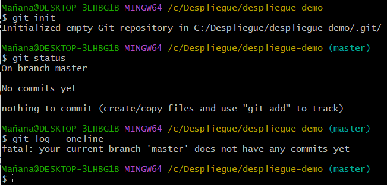

# Tarea 02 · Despliegue de Aplicaciones Web
___
## Oliver Fabian Stetcu Stepanov
___
### Tarea Git - Github - Markdown - Visual Studio Code
___
>Crea un repositorio PRIVADO en Github con la documentación de esta práctica. Añade la profesor
como colaborador de ese repositorio. Redacta la práctica usando Markdown, aporta trozos de código
con los comandos git y capturas de pantalla.
# Git.
___
## Instalación y configuración inicial. (config)
>Para trabajar en Windows con git utilizaremos la terminal: git bash.

Instala o comprueba que ya este instalado el servicio: git.
>Utiliza --version para mostrar la versión.

>Utiliza el comando which git para saber la ubicación del ejecutable.

Muestra el archivo de configuración global de git.
>El archivo de configuración global de git, si está creado, se encuentra en: ~/.gitconfig

Configura de forma global los datos de usuario: nombre y correo electrónico.

Muestra el listado de las distintas opciones de configuración.

Vuelve a mostrar el archivo de configuración global.

Primero, vamos a comprobar que tenemos instalado nuestro servicio ``git`` y queremos saber la ubicación del ejecutable. Para ello, 
vamos a darle click derecho en nuestra carpeta de **Despliegue/DocumentacionTarea02** y ponemos los siguientes comandos:

```bash
git --version
which git
```
Resultado:


Ahora muestro el archivo de configuración global de ``git`` (se encuentra en ``~/.gitconfig.``):

```bash
cat ~/.gitconfig
```
Resultado:


Configuramos de forma global los datos del usuario (usuario y correo electrónico) y mostramos el listado de las distintas opciones de configuración, ejecutamos los siguientes comandos:

```bash
git config --global user.email oliverfabian22@gmail.com
git config --global user.name ZiwiiDev
git config --list
```
Resultado:


Volvemos a mostrar el archivo de configuración global (en mi caso saldrá lo mismo porque ya lo tenía configurado de antes):

```bash
cat ~/.gitconfig
```
Resultado:


## Crear repositorios locales (init, status, add, commit, log)
Vamos a crear un repositorio llamado despliegue-demo. Crea una carpeta con el mismo nombre que el repositorio y accede a ella.

Inicia un repositorio.

>Recuerda usar ``git status`` y ``git log --oneline`` para ir comprobando el estado de git y los registros de commit.

Muestra el estado de git antes de nada.

Muestra también los registros de commit antes de realizar cambios. Como aún no has hecho ningún commit, debe darte un error.

Crea desde la línea de comandos un archivo **README.md** que contenga el nombre del repositorio.

>Puedes crear un archivo desde terminal con el comando ``echo 'Contenido del archivo' > archivo.md.`` Si lo que quieres es un archivo vacío puedes usar el comando ``touch archivo.md`` y después con ``nano`` darle contenido.

Vuelve a mostrar el estado de git después de crear un archivo.

Añade el archivo recién creado al área de intercambio o ``staged``.

Vuelve a mostrar el estado de git después de añadir un archivo al ``staged``.

Añade los archivos del área de intercambio al repositorio local con ``commit``.

>Recuerda poner un mensaje al realizar el commit, con ``-m "mensaje"``.

Vuelve a mostrar el estado de git después de añadir un archivo al ``commit``.

Muestra los registros de commit después de realizar este primer commit.

Existe un comando git para a modificar el último commit. Este comando elimina el último commit y
crea otro nuevo con los cambios actuales del ``staged``. El comando es ``git commit --amend -m "mensaje"``.

Primero vamos a crear un repositorio **despliegue-demo**, vamos a crear la carpeta con este nombre y accedemos a ella:

```bash
cd ..
mkdir despliegue-demo
cd despliegue-demo
```
Resultado:


Inicializamos el repositorio, comprobamos el estado de git y comprobamos el registro de commits (como no hemos hecho ningún commit nos da un error):

```bash
git init
git status
git log --oneline
```
Resultado:



Creamos un archivo **README.md** y mostramos el estado de git después de crear el archivo:

```bash
touch README.md
nano README.md
git status
```
Resultado:


Añado el archivo recién creado al **staged**, muestro el estado de git después de añadirlo de la siguiente manera:

```bash
git add README.md
git status
```
Resultado:


Añado el archivo al repositorio local, le ponemos mensaje, y muestro el estado:

```bash
git commit -m "Añado README.md"
git status
```
Resultado:


Muestro los registros de commit después de realizar el primer commit:

```bash
git log --oneline
```
Resultado:


